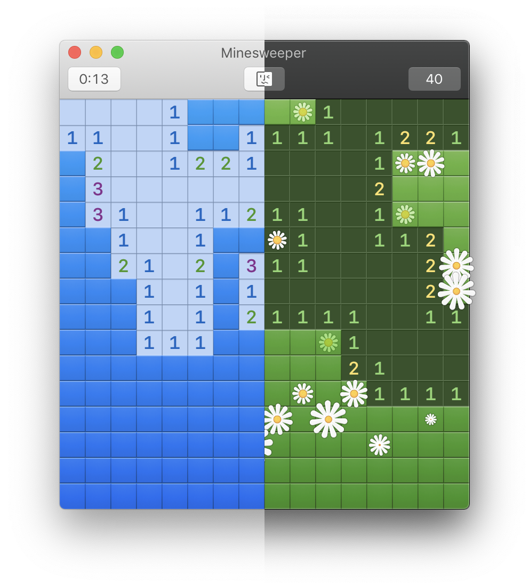
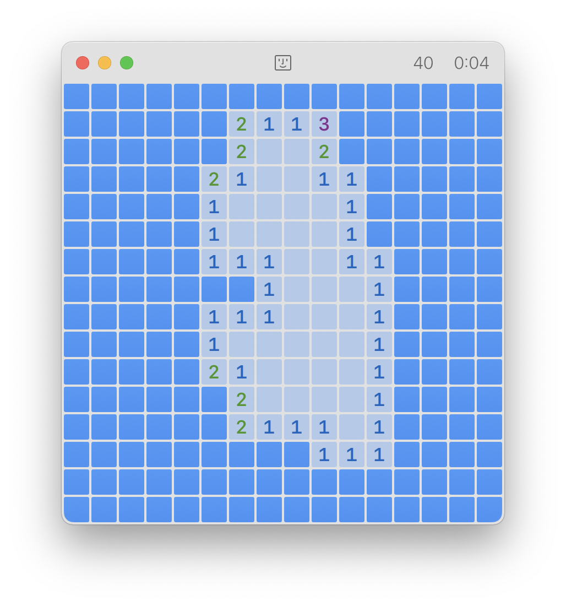

# Minesweeper
Minesweeper for Mac.


## System Requirements
≥ macOS Sierra 10.12



And color varies with system accent.

## Appearances
This Xcode project includes two icon files:

- "AppIcon.X.icns" designed for macOS Catalina and below
- "AppIcon.XI.icns" designed for macOS Big Sur and above

and neither of them is currently set as the app icon. Before building, you may manually opt for one by renaming an icon file to "AppIcon.icns" or edit Info.plist directly.

Also, style of minefields can be manually set regardless of the system version by

```
defaults write red.argon.minesweeper FieldStyle -int <0|1>
```

where `0` is for a classic style and `1` for a flatter style.

*Note*: `FieldStyle -int 1` may not work well on macOS High Sierra and below.

## License
All files in this repository are under the MIT license and you are supposed to include a copy of the license in your own distribution.
